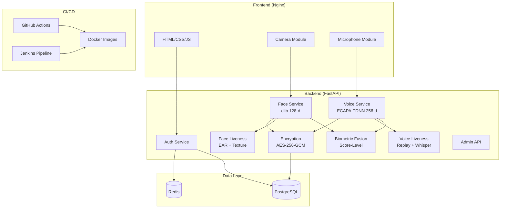

# 🛡 FaceVoiceAuth

**Enterprise Tri-Modal Biometric Authentication Platform**

A production-grade hybrid authentication system combining password login, face recognition, and voice verification with score-level biometric fusion.

---

## 🏗 Architecture



---

## 🚀 Quick Start

### Docker (one command)

```bash
cp .env.example .env
docker-compose up --build
```

- **Frontend**: http://localhost:8081
- **Backend API**: http://localhost:8000
- **API Docs**: http://localhost:8000/docs

### Local Development

```bash
# Backend
cd facevoiceauth
python -m venv .venv
source .venv/bin/activate  # Windows: .venv\Scripts\activate
pip install -r backend/requirements.txt
uvicorn backend.main:app --host 0.0.0.0 --port 8000 --reload

# Frontend (serve static files)
cd frontend
python -m http.server 3000
```

---

## 📡 API Reference

| Method | Endpoint | Description |
|--------|----------|-------------|
| `POST` | `/api/auth/register` | Register new user |
| `POST` | `/api/auth/login` | Password login |
| `POST` | `/api/auth/refresh` | Refresh JWT token |
| `POST` | `/api/auth/logout` | Logout / revoke session |
| `GET` | `/api/auth/me` | Get current user profile |
| `POST` | `/api/auth/totp/setup` | Initialize 2FA |
| `POST` | `/api/auth/totp/verify` | Verify & enable 2FA |
| `GET` | `/api/auth/sessions` | List active sessions |
| `DELETE` | `/api/auth/sessions/{id}` | Revoke a session |
| `POST` | `/api/face/enroll` | Enroll face angle |
| `POST` | `/api/face/verify` | Verify face identity |
| `GET` | `/api/face/status` | Face enrollment status |
| `DELETE` | `/api/face/enroll` | Delete face enrollment |
| `POST` | `/api/voice/enroll/start` | Start voice enrollment |
| `POST` | `/api/voice/enroll/sample` | Upload voice sample |
| `POST` | `/api/voice/enroll/complete` | Finalize voice enrollment |
| `POST` | `/api/voice/verify` | Verify voice identity |
| `GET` | `/api/voice/status` | Voice enrollment status |
| `DELETE` | `/api/voice/enroll` | Delete voice enrollment |
| `POST` | `/api/biometric/login` | Combined face+voice login |
| `GET` | `/api/admin/users` | List users (admin) |
| `GET` | `/api/admin/health` | System health (admin) |
| `POST` | `/api/admin/backup` | Trigger backup (admin) |
| `GET` | `/health` | Public health check |
| `GET` | `/metrics` | Prometheus metrics |

---

## 🔒 Security Architecture

### Biometric Data Protection
- **AES-256-GCM** encryption for all face encodings and voice prints
- **Per-user keys** derived via PBKDF2-HMAC-SHA256 (100,000 iterations)
- Master key loaded from environment — never hardcoded
- Key rotation support without downtime
- **No raw images or audio stored** — only encrypted embeddings

### Anti-Spoofing
- **Face**: Blink detection (EAR), head motion challenge, Laplacian texture analysis, depth cue analysis
- **Voice**: Frequency spectrum replay detection, silence ratio check, Whisper-based challenge-response

### Authentication
- bcrypt password hashing (cost factor 12)
- JWT access tokens (15 min) + httpOnly refresh tokens (7 days)
- TOTP 2FA with QR code + backup codes
- Progressive lockout: 5 failures → 1min, 5min, 30min, permanent
- CSRF double-submit cookie protection
- Rate limiting per endpoint

---

## 🔧 Environment Variables

See [`.env.example`](.env.example) for the complete reference with all configurable variables.

Key variables:
| Variable | Default | Description |
|----------|---------|-------------|
| `SECRET_KEY` | auto-generated | JWT signing key (min 64 chars) |
| `MASTER_KEY` | auto-generated | AES master key (base64, 32 bytes) |
| `FACE_MATCH_THRESHOLD` | `0.45` | Euclidean distance threshold |
| `VOICE_MATCH_THRESHOLD` | `0.82` | Cosine similarity threshold |
| `FACE_FUSION_WEIGHT` | `0.6` | Face weight in fusion score |
| `VOICE_FUSION_WEIGHT` | `0.4` | Voice weight in fusion score |
| `MAX_LOGIN_ATTEMPTS` | `5` | Before lockout triggers |

---

## 🚢 Production Deployment Guide

Follow these steps for a **"perfect" production deployment** on a Linux server (Ubuntu 22.04+ recommended).

### 1. Server Preparation
Ensure Docker and Docker Compose are installed:
```bash
sudo apt update && sudo apt install -y docker.io docker-compose
sudo usermod -aG docker $USER  # Logout and login again
```

### 2. Configuration & Secrets
Never use development keys in production. Generate fresh ones:

```bash
# Generate JWT Secret Key
python3 -c "import secrets; print(secrets.token_urlsafe(64))"

# Generate AES Master Key (Base64, 32 bytes)
python3 -c "import base64, os; print(base64.b64encode(os.urandom(32)).decode())"
```

1. Create a production environment file: `cp .env.example .env.prod`
2. Update `.env.prod` with the generated keys and set `ENVIRONMENT=production`.
3. Create the database password secret:
```bash
mkdir -p secrets
openssl rand -base64 24 > secrets/db_password.txt
```

### 3. Deployment Execution
Launch the full stack using the production-optimized compose file:

```bash
docker-compose -f docker-compose.prod.yml up -d --build
```

This starts:
- **FastAPI Backend** (Uvicorn with 4+ workers)
- **Nginx** (Frontend + Reverse Proxy + Security Headers)
- **PostgreSQL 16** (Persistent volume)
- **Redis 7** (For rate limiting & caching)

### 4. Database Initialization
Once the containers are running, apply the database schema:

```bash
docker exec -it facevoiceauth-backend-prod alembic upgrade head
```

### 5. Securing with SSL (Certbot)
To enable HTTPS, use Certbot to generate certificates:

```bash
sudo apt install certbot
sudo certbot certonly --manual -d yourdomain.com
```

Then, link your certificates to the `docker/nginx.conf` or use a reverse proxy like Traefik/Nginx Proxy Manager.

### 6. Admin Security
> [!CAUTION]
> Immediately change the default admin password after the first login or via the `.env.prod` file:
> `ADMIN_PASSWORD=YourSuperSecurePassword!`

### 7. Post-Deployment Verification
Verify the system health:

```bash
# Check if all containers are healthy
docker ps

# Test the health endpoint
curl -f http://localhost/health

# Monitor production logs
docker-compose -f docker-compose.prod.yml logs -f --tail=100
```

---

## ☁️ Deploy to Render

The easiest way to deploy the entire stack is using the **Render Blueprint**.

### One-Click Deploy
1. Push your code to your GitHub repository.
2. Go to the **Blueprints** section in your [Render Dashboard](https://dashboard.render.com/blueprints).
3. Connect this repository.
4. Render will automatically detect the `render.yaml` file and set up:
   - **PostgreSQL** (Managed Database)
   - **Redis** (Managed Cache)
   - **Backend** (FastAPI Docker container)
   - **Frontend** (Nginx Docker container)

### Manual Setup (Docker)
If you prefer manual setup for each service:

**1. Create a Web Service for Backend:**
- **Runtime**: Docker
- **Dockerfile Path**: `docker/Dockerfile.backend`
- **Env Vars**: Add `DATABASE_URL`, `REDIS_URL`, `SECRET_KEY`, `MASTER_KEY`.

**2. Create a Web Service for Frontend:**
- **Runtime**: Docker
- **Dockerfile Path**: `docker/Dockerfile.frontend`
- **Env Vars**: Add `BACKEND_URL` pointing to your backend service.

---

## 🏗 Jenkins Setup

To configure and run the CI/CD pipeline for **FaceVoiceAuth** via Jenkins, follow this comprehensive step-by-step setup guide.

### 📋 Prerequisites

1. **Jenkins Server**: Ensure you have Jenkins installed on a Linux/Docker host.
2. **Tools Installed on Jenkins Agent**:
   - **Docker** and **Docker Compose** installed.
   - The `jenkins` user must be in the `docker` group: `sudo usermod -aG docker jenkins` (restart Jenkins after adding).
   - **Python 3.10+** (with `pip` and `venv`) installed on the agent.
   - **Git** installed on the agent.

---

### 🧩 Step 1: Install Required Jenkins Plugins

Go to **Manage Jenkins** > **Plugins** > **Available Plugins** and install the following if not already present:

- `Pipeline` (Core Jenkins pipeline features)
- `Docker Pipeline` (For building/running Docker images inside the pipeline)
- `SSH Agent` (For staging/production SSH deployments)
- `GitHub Integration` (For automatic triggers via webhooks)
- `JUnit` (For publishing test results)
- `HTML Publisher` (For publishing the coverage reports)

---

### 🔑 Step 2: Configure Credentials in Jenkins

Navigate to **Manage Jenkins** > **Credentials** > **System** > **Global credentials (unrestricted)**. Add the following credentials to align with the variables in the `Jenkinsfile`:

| ID | Type | Secret/Value | Purpose |
|----|------|--------------|---------|
| `REGISTRY_URL` | Secret text | `docker.io` (or your registry) | URL of your container registry |
| `docker-hub-credentials` | Username with password | Your Docker ID & Access Token | Registry login credentials |
| `staging-ssh-host` | Secret text | IP or Domain of Staging Host | Host address for staging deployments |
| `prod-ssh-host` | Secret text | IP or Domain of Prod Host | Host address for production deployments |
| `staging-ssh-key` | SSH Username with private key | User: `deploy` + private key | SSH key to connect to Staging server |
| `prod-ssh-key` | SSH Username with private key | User: `deploy` + private key | SSH key to connect to Production server |

---

### 🔨 Step 3: Create and Configure the Pipeline Job

1. From the Jenkins dashboard, click **New Item**.
2. Enter the item name: **`FaceVoiceAuth-Pipeline`**, select **Pipeline**, and click **OK**.
3. Under the **General** tab:
   - Check **GitHub project** and enter your repository URL: `https://github.com/YourUsername/facevoiceauth.git`.
4. Under the **Build Triggers** tab:    
   - Check **GitHub hook trigger for GITScm polling** to allow webhook-triggered builds on every code push.
5. Under the **Pipeline** section at the bottom:
   - For **Definition**, select **Pipeline script from SCM**.
   - For **SCM**, select **Git**.
   - For **Repository URL**, enter your Git repository URL.
   - For **Credentials**, select your Git credentials if it's a private repo.
   - For **Branch Specifier**, enter `*/main` (or match your main branch).
   - For **Script Path**, ensure it's set to **`Jenkinsfile`** (this is located at the root of the workspace).
6. Click **Save**.

---

### 🔄 Step 4: Add Webhook in GitHub

To trigger automatic builds when changes are pushed:

1. Go to your repository on **GitHub** > **Settings** > **Webhooks** > **Add webhook**.
2. Set the **Payload URL** to: `http://<your-jenkins-server-url>:8080/github-webhook/`.
3. Set **Content type** to: `application/json`.
4. Leave other settings as default, select **Just the push event**, and click **Add webhook**.

---

### 🚀 Step 5: Run Your First Build

1. Back on the Jenkins job page, click **Build Now** in the left sidebar.
2. Jenkins will checkout the source code, run parallel format & lint tests, execute backend unit tests, build Docker containers, perform smoke tests, push them to Docker Hub, and wait for deployment review or directly deploy depending on branch setup.
3. You can review unit tests using the **Test Result** tab and view the HTML coverage reports via the **Coverage Report** tab.

---

## 🐙 GitHub Actions Setup

Workflows are in `.github/workflows/`:
- **`ci.yml`** — Runs on every push: lint → test (Python 3.10/3.11/3.12) → Docker build → security scan
- **`cd.yml`** — Runs on main push: build + push to GHCR → deploy staging → deploy production (on tags only)
- **`security-scan.yml`** — Scheduled daily: Trivy + OWASP dependency check

Required secrets:
- `GITHUB_TOKEN` (automatic)
- Staging/production deployment SSH keys (in environment settings)

---

## 🔨 Troubleshooting

### dlib Installation

**Windows:**
```bash
pip install cmake
pip install dlib
# If fails, install Visual Studio Build Tools with C++ support
```

**Linux (Ubuntu/Debian):**
```bash
sudo apt-get install cmake build-essential libopenblas-dev liblapack-dev
pip install dlib
```

**macOS:**
```bash
brew install cmake openblas
pip install dlib
```

### Common Issues

| Issue | Solution |
|-------|----------|
| `dlib not found` | Backend runs in simulation mode — no face models needed for development |
| `speechbrain import error` | Voice service runs in simulation mode — install torch + speechbrain for full functionality |
| `Port 8081/8000 busy` | Change the host port in `docker-compose.yml` or stop the service using it (e.g., `netstat -ano \| findstr :8081`) |
| `MASTER_KEY validation` | Generate: `python -c "import base64,os;print(base64.b64encode(os.urandom(32)).decode())"` |
| `Redis connection refused` | Start Redis or set `REDIS_URL=memory://` for in-memory rate limiting |

---

## 📁 Project Structure

```
facevoiceauth/
├── backend/               # FastAPI application
│   ├── main.py            # App entrypoint
│   ├── config.py          # Settings from env vars
│   ├── database.py        # Async SQLAlchemy engine
│   ├── models/            # ORM models (User, Face, Voice, Session, Audit)
│   ├── routers/           # API routes (auth, face, voice, biometric, admin, health)
│   ├── services/          # Business logic (recognition, liveness, encryption, fusion)
│   ├── middleware/         # CSRF, rate limiting, audit logging
│   ├── schemas/           # Pydantic request/response models
│   └── tests/             # pytest test suites
├── frontend/              # Static HTML/CSS/JS
│   ├── css/               # Design system, glassmorphism, animations
│   └── js/                # Camera, microphone, auth, enrollment modules
├── docker/                # Dockerfiles + nginx config
├── .github/workflows/     # GitHub Actions CI/CD
├── Jenkinsfile            # Jenkins pipeline
├── pom.xml                # Maven build orchestration
└── docker-compose.yml     # Development environment
```

---

## 🤝 Contributing

1. Fork the repository
2. Create a feature branch: `git checkout -b feature/amazing-feature`
3. Write tests for your changes
4. Ensure linting passes: `flake8 backend/ && black backend/ && isort backend/`
5. Run the test suite: `pytest backend/tests/ -v`
6. Commit with conventional commits: `git commit -m "feat: add amazing feature"`
7. Push and create a Pull Request

---

## 📄 License

This project is licensed under the MIT License. See [LICENSE](LICENSE) for details.

---

<div align="center">
<strong>Built with 🛡 for enterprise security</strong><br>
FastAPI · dlib · SpeechBrain · AES-256-GCM · Docker · Jenkins · GitHub Actions
</div>
